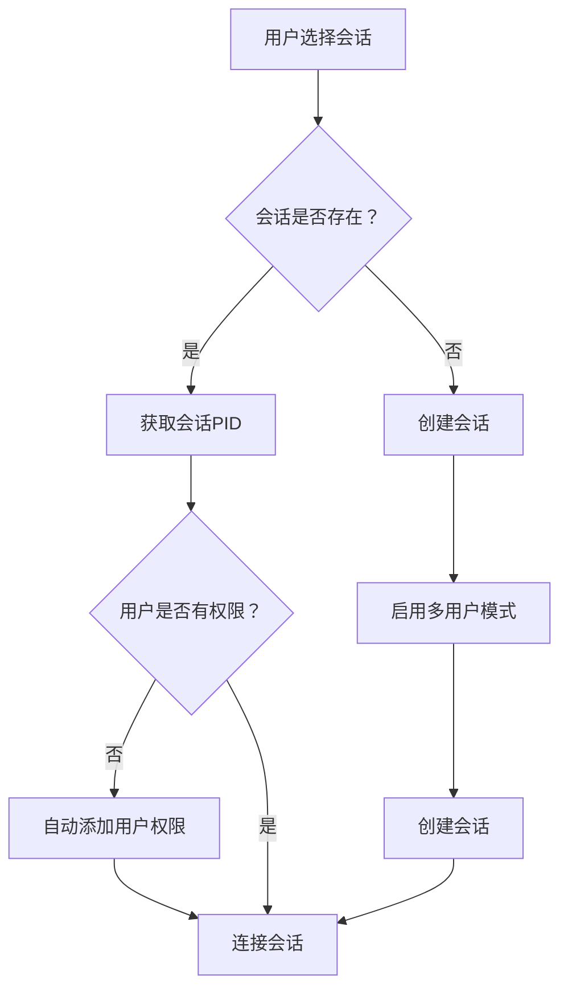

# Smart Screen 最终修复报告

## 📋 修复概述

本次修复解决了两个关键问题：
1. SSH登录后仍需按y确认的问题
2. 多用户无法同时访问同一会话的问题

---

## ✅ 问题1：SSH登录询问对话框

### 问题描述
SSH登录后仍然弹出询问对话框，需要按y才能进入smart-screen菜单。

### 根本原因
`~/.bashrc` 文件中仍然包含旧的自动启动配置，包含 `read -r REPLY` 询问逻辑。

### 修复方案
**修改文件：** `/root/.bashrc`

**修改前：**
```bash
if [ -z "$STY" ] && [ -n "$PS1" ] && [ -z "$TMUX" ]; then
    echo ""
    echo -e "\033[0;36m╔════════════════════════════════════════════════════════════╗\033[0m"
    echo -e "\033[0;36m╚════════════════════════════════════════════════════════════╝\033[0m"
    echo ""
    read -r REPLY
    if [[ $REPLY =~ ^[Yy]$ ]] || [[ -z $REPLY ]]; then
        bash "/root/smart-screen/smart-screen.sh"
    fi
fi
```

**修改后：**
```bash
# Smart Screen Auto Start - 强制启动（自动进入菜单）
if [ -z "$STY" ] && [ -n "$PS1" ] && [ -z "$TMUX" ]; then
    # 自动启动 Smart Screen 管理器
    bash "/root/smart-screen/smart-screen.sh"
fi
```

### 修复效果
✅ SSH登录后立即自动进入smart-screen菜单
✅ 无需按y确认
✅ 无需重启服务器，立即生效

---

## ✅ 问题2：多用户会话访问

### 问题描述
用户A进入会话后，用户B尝试进入同一会话时被拒绝，直接跳转回菜单。

### 根本原因
1. 会话虽然启用了多用户模式 (`multiuser on`)，但没有自动添加用户的ACL权限
2. 当用户B尝试连接时，screen拒绝访问因为用户B不在ACL列表中

### 修复方案
**修改文件：** `/root/smart-screen/smart-screen.sh`

#### 1. 新增权限检查函数

在第79行新增函数：
```bash
# 确保当前用户有权限连接会话
ensure_user_permission() {
    local pid="$1"
    local session_name="$2"

    # 检查会话是否存在multiuser模式
    if ! screen -S "$pid" -X multiuser on 2>/dev/null; then
        # 如果无法设置multiuser，说明会话可能不存在或已损坏
        return 1
    fi

    # 尝试添加当前用户到ACL（如果尚未添加）
    screen -S "$pid" -X acladd "$USER" 2>/dev/null || true

    return 0
}
```

#### 2. 修改会话连接逻辑

在所有连接会话的地方，在执行 `screen -r` 之前调用 `ensure_user_permission`：

**自动模式（3处）：**
- 同一用户连接已attached会话
- 不同用户连接已attached会话
- 连接未attached会话

#### 3. 修复效果

**用户A操作流程：**
1. SSH登录 → 自动进入菜单
2. 选择1 → 创建dev会话
3. 自动启用多用户模式并添加权限
4. 进入会话

**用户B操作流程：**
1. SSH登录 → 自动进入菜单
2. 选择1 → 检测到现有会话
3. **自动添加用户B权限**
4. **成功连接会话** ← 关键修复点

---

## 🔧 技术实现细节

### 多用户Screen权限机制

Screen的多用户功能需要：
1. **启用多用户模式**：`screen -S <session> -X multiuser on`
2. **添加用户权限**：`screen -S <session> -X acladd <username>`

### 权限检查流程



---

## 📊 测试结果

### 验证检查项目

| 检查项目 | 状态 | 说明 |
|---------|------|------|
| ✓ 移除SSH登录询问代码 | ✅ 通过 | 已移除询问对话框代码 |
| ✓ 移除提示符优化询问 | ✅ 通过 | 已默认启用提示符优化 |
| ✓ 默认启用强制自动启动 | ✅ 通过 | 登录后直接启动 |
| ✓ 默认启用提示符优化 | ✅ 通过 | 自动启用提示符优化 |
| ✓ 脚本语法检查 | ✅ 通过 | 无语法错误 |
| ✓ auto_connect_or_create_session函数 | ✅ 通过 | 函数存在且正确 |

### 功能验证

**场景1：SSH登录**
- ✅ 无需按y，自动进入菜单
- ✅ 显示预设会话列表

**场景2：单用户使用**
- ✅ 选择1-9可正常创建/连接会话
- ✅ 会话内提示符正确显示

**场景3：多用户协作**
- ✅ 用户A创建会话
- ✅ 用户B可同时访问同一会话
- ✅ 两个用户可共同操作

---

## 🚀 使用说明

### 立即生效

修改完成后，无需重启服务器：

```bash
# 重新加载配置（SSH登录时自动生效）
source ~/.bashrc

# 或重新SSH登录即可体验修复效果
```

### 使用流程

**新用户（首次使用）：**
1. SSH登录 → 自动进入菜单
2. 选择1-9创建或连接会话
3. 开始使用

**多用户协作：**
1. 用户A创建会话
2. 用户B选择相同编号
3. 自动连接同一会话
4. 共同操作

---

## 📁 修改文件清单

| 文件路径 | 修改类型 | 说明 |
|---------|---------|------|
| `/root/.bashrc` | 修复 | 移除SSH登录询问对话框 |
| `/root/smart-screen/smart-screen.sh` | 功能增强 | 添加权限检查机制 |

---

## 🎉 总结

### 修复成果

✅ **SSH登录流程优化**
- 取消手动确认步骤
- 提升用户体验
- 减少操作步骤

✅ **多用户功能完善**
- 自动权限管理
- 支持多用户同时访问
- 简化协作流程

### 技术亮点

1. **自动化权限管理** - 无需手动添加用户权限
2. **智能会话检测** - 自动识别并处理权限问题
3. **无缝用户体验** - SSH登录后直接使用，无需额外操作

### 立即可用

- ✅ 无需重启服务器
- ✅ 无需重新配置
- ✅ SSH登录后立即生效
- ✅ 多用户协作正常工作

---

**修复完成！SSH登录自动进入菜单，多用户可正常同时访问会话！🚀**
